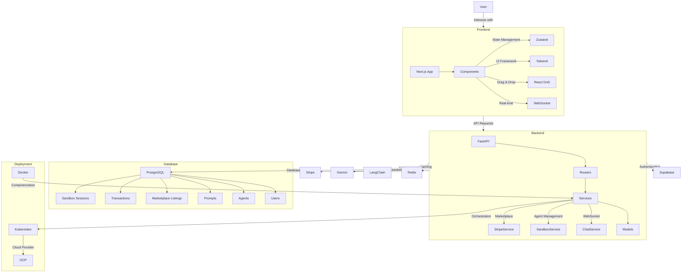

```mermaid
graph TD
    User[User] --> |Interacts with| Frontend
    Frontend --> |API Requests| Backend
    Backend --> |Authentication| Supabase
    Backend --> |Database Queries| PostgreSQL
    Backend --> |Caching| Redis
    Backend --> |AI Orchestration| LangChain
    Backend --> |Conflict Resolution| Gemini
    Backend --> |Payments| Stripe
    
    subgraph Frontend
        NextJS[Next.js App] --> Components
        Components --> |State Management| Zustand
        Components --> |UI Framework| Tailwind
        Components --> |Drag & Drop| ReactDND[React DnD]
        Components --> |Real-time| WebSocket
    end
    
    subgraph Backend
        FastAPI --> Routers
        Routers --> Services
        Services --> Models
        Services --> |WebSocket| ChatService
        Services --> |Agent Management| SandboxService
        Services --> |Marketplace| StripeService
    end
    
    subgraph Database
        PostgreSQL --> UsersTable[Users]
        PostgreSQL --> AgentsTable[Agents]
        PostgreSQL --> PromptsTable[Prompts]
        PostgreSQL --> MarketplaceTable[Marketplace Listings]
        PostgreSQL --> TransactionsTable[Transactions]
        PostgreSQL --> SandboxTable[Sandbox Sessions]
    end
    
    subgraph Deployment
        Docker --> |Containerization| Services
        Services --> |Orchestration| Kubernetes
        Kubernetes --> |Cloud Provider| GCP
    end
```
